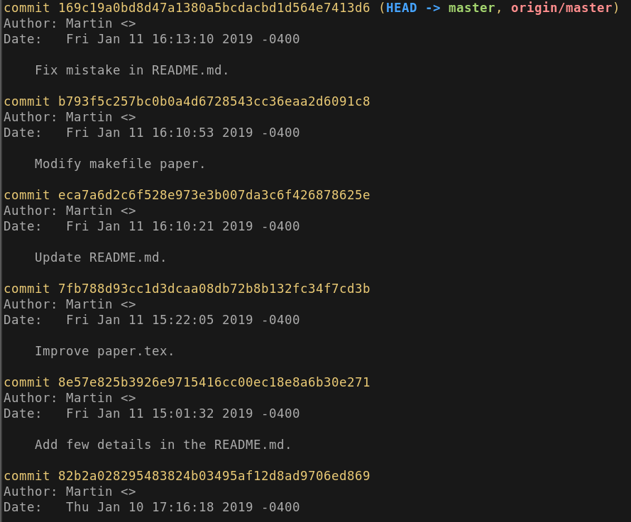
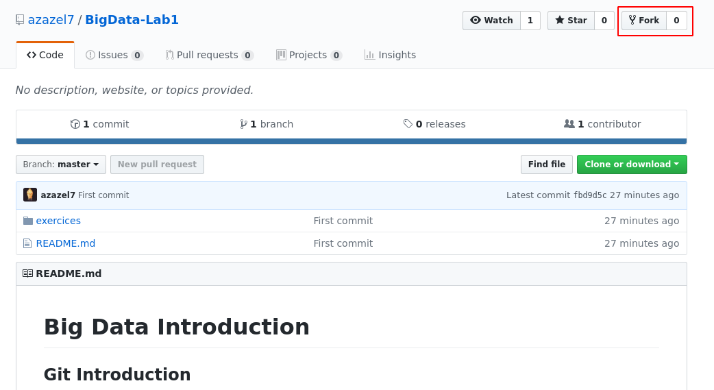

# Big Data Introduction
The goal of this presentation is to introduce tools you will need in the class:
- An overview of Git
- GitHub Account
- An overview of Python
- An overview of Pytest

## Cheat Sheets
- [Git sheet](https://services.github.com/on-demand/downloads/github-git-cheat-sheet.pdf)
- [Pyspark sheet](https://s3.amazonaws.com/assets.datacamp.com/blog_assets/PySpark_Cheat_Sheet_Python.pdf)
- [Python sheet](https://perso.limsi.fr/pointal/_media/python:cours:mementopython3-english.pdf)
- [Another Python sheet](https://programmingwithmosh.com/python/python-3-cheat-sheet/)

## Git Introduction
- [Git Guide](https://rogerdudler.github.io/git-guide)

Git is a versioning software like SVN or Mercurial.
There are multiple advantages to use git:
- Decentralized
- Free and Open Source
- Efficient
- GitHub website

### Workflow
#### In a perfect world
- `git add <filename>` : Add your modification to git.
- `git commit` : Validate your modification.
- `git commit --amend` : Fix a local commit.
- `git push origin master` : Push your local commit to a distant repository.
- `git pull origin master` : Pull and merge the last commit from a distant repository.

#### Bug Hunting
- `git log` : List all the commits.


- `git checkout b793f5c257bc0b0a4d6728543cc36eaa2d6091c8` : Rollback to the chosen commit.
- `git checkout HEAD~1` : Rollback to the previous commit.

### Create GitHub account
You can create a new GitHub account [here](https://github.com/join).
### Get the repository
The repository for this lab is located [here](https://github.com/azazel7/BigData-Lab1)

#### Fork the repository
Forking a repository create a copy of the original repository on your GitHub
account. Which enables you to have full control over the repository. 

#### Clone the repository
Cloning a git repository will download the entire history of the repository on your computer.

- `git clone <url>`

## Python Introduction
### Required
- Python 3.5

### Motivations for Python
- Python is very popular in science and engineering: check [SciPy](https://scipy.org), [scikit-learn](http://scikit-learn.org).
- Python is free software (as in freedom)
- Python is portable, available for all major operating systems
- Python is a versatile language, "the second best language for everything"
- Python has a lively online community, active on [Stackoverflow](https://stackoverflow.com) and many other forums

### Other notes
- Python is an object-oriented language
- Python is an interpreted language
- [Google](google.com) and [Stackoverflow](https://stackoverflow.com) are your best friends!

### Hello World
```python
print("Hello world")
print('Hello world')
```
### Variables
Python is dynamically typed.
In this first example, `otter` is set as an integer and its value equal to 3.
```python
otter = 3
```
Right after assigning 3 to `otter` you can change your mind and assign a string ...
```python
otter = "Otters will rule the world."
otter = 'Otters will rule the world.'
```
... or a list.
```python
otter = ["Otters", "will", "rule", "Mars", "in", "2037"]
otter = [67, 51, 17, 101, 48]
```

Complex numbers also work:
```python
otter = 3 + 2j
```
### Basic operations
Python is able to do all basic operations.
```python
a = 10
b = 3
```
```python
a + b
Output: 13
a - b
Output: 7
a / b
Output: 3.33
a * b
Output: 30
a % b
Output: 1
```
### Containers
#### Tuples
A tuple is an immutable serie of variables.
```python
parrot = (1, True, "otter")
print(parrot[1])
Output: True
```
You cannot modify a tuple.
```python
parrot[2] = 7 #This won't work
parrot[2].append('a') #Works because a string act like a reference.
parrot[2] = parrot[2] + "platypus" # Won't work because your are reassigning the tuple
```

Note: RDDs in Spark usually work with tuples.

#### Lists
A list is a mutable serie of variables.
```python
turtle = ["whale", 1, True] #Instanciate a new list with three values.
```

You can re-assigne the values and modify the list.
```python
turtle[0] = "fish" # assignes the string "fish" to the first element of the list
print(turtle)
["fish", 1, True]

turtle.append(72) # will append the value 72
print(turtle)
["fish", 1, True, 72]
```

#### Dictionaries
A dictionary is a mutable collection of key-value pairs. The idea is to access
values with indexes made of object rather than integers.
```python
otter = {"names" : ["Mike", "Ali"],
		 4 : True, 
		 "animals" : 78}
```
You can access the value of each index just like that:
```python
otter["names"]   # output ["Mike", "Ali"]
otter[4]     # output True
otter["animals"] # output 78
```

### Control Statements

#### If/Elif/Then statements

The python code for a basic conditionnal statement.
```python
otter = 10
if otter % 2 == 0:
	print(otter)
elif otter == 17:
	print("Otter equals 17")
else:
	print("Nothing much")
```

Now an equivalent in java. Note the importance of the indentation in python.
```java
int otter = 10
if(otter%2 == 0){
	System.out.printf("%d", otter);
}
else if(otter == 17){
System.out.printf("Otter equals 17");
}
else{
		System.out.printf("Nothing much");
}
```
#### While statements
```python
otter = 0
while otter % 10 != 9:
	print(otter)
	otter = otter + 1
```

The java equivalent:
```java
int otter = 10
while(otter % 10 != 9){
	System.out.printf("%d", otter);
	otter = otter + 1
}
```
#### For statements
The idea of the `for` statement is to browse through a list.
```python
for i in range(10):
	print(i)
```

The java equivalent is shown below:
```java
for(int i = 0; i < 10; i = i+1){
	System.out.printf("%d", i);
}
```

Another python example:
```python
otter = ["platypus", 78, {}, "42"]
for i in otter:
	print(i)
```
#### Containers in one line
To be quicker, it may be interesting to build lists and dictionaries from a for loop.
```python
otter = [i*10 for i in range(10)]
whale = {i*10:i for i in range(10)}
```

#### Functions
Function is a good way of spliting your program in re-usable piece of code.

```python
def turtle(p):
	return p * 3

turtle(3) # the return value should be 9
```

If it is a one time function that could be writen in one line you can define a `lambda` function instead:
```python
turtle = lambda p: p * 3
turtle(3) # the return value is 9
```

Note that either your are creating a lambda function or a normal function, you are able to access variables outside the scope of the lambda.

```python
otter = 4
turtle = lambda p: p * otter
turtle(3) # the return value is 12
```

### Modules
At some point, it is interesting to keep separate files for different type of functions.
The `import` keyword enable python to load a python file.

How to call the cosinus function from the `math` module:
```python
import math
math.cos(3.14)
```

Importing a module and renaming it.
```python
import math as otter
otter.cos(3.14)
```

Import a specific function from a module.
```python
from math import cos
cos(3.14)
```

Import a specific function and renaming it.
```python
from math import cos as otter
otter(3.14)
```

Note that the import keyword will make python look into all the paths of your environment variable `PYTHONPATH`.

## Pytest
Pytest is a test framework that make it easy to write simple unit test.

Here is a quick example. Let us assume the file `test_sample.py` contains the
following lines:
```python
def inc(x):
    return x + 1

def test_answer():
	assert inc(3) == 5
```

To run the tests, just run one of the following commands:
```python
pytest
pytest test_sample.py
```

The `pytest` command check for files starting with the `test_` and will run function when their names also start with `test_`.
